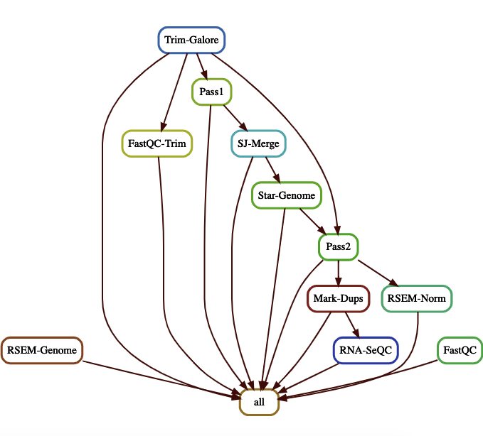

# RNA-Seq-Flow

RNA-Seq analyis using STAR two pass mode for alliging the raw reads and RSEM for transcript quantification using snakemake workflow.
  
    

## Required Tools  

 * FastQC (Quality Control) 

 * Trim-galore ( Adapter Trimming)

 * STAR (Allign the reads to reference genome) 

 * Picard (Remove Duplicates)

 * RNA-SeQC(Qualiy Control of RNA-Seq data)

 * RSEM(Transcript Quantification)


## Setting up conda environment for tools and their dependencies 

* Install anaconda or load it if its already on your server

* conda create --name rnaseq-env

* source activate rnaseq-env

* conda install -c bioconda star

* conda install -c bioconda fastqc

* conda install -c bioconda rsem


### Generate the .txt report of all fastqc "run fastqc-summary script in fastqc output directory" 
```
 python3 fastqc-summary -s $INDIR > "QC_Report.txt"
```

### To quantify the gene expression level and compatibility with RNA-SeQC, the gencode GTF need to be collapsed using the `gtex` script [collapse_annotation.py](https://github.com/broadinstitute/gtex-pipeline/blob/master/gene_model/collapse_annotation.py)
```python
python3 collapse_annotation.py gencode.v30.GRCh38.genes.gtf gencode.v30.GRCh38.genes.gtf
```
### Run the pipeline on cluster using this command 'modify cluster.json  parameters according to your cluster configuration 
```
snakemake -j 999 --configfile config.yaml --use-conda --nolock --cluster-config cluster.json --cluster "sbatch -A {cluster.account} -p {cluster.partition}  -N {cluster.N} -n {cluster.n}  -t {cluster.time} --mem {cluster.mem}"
```